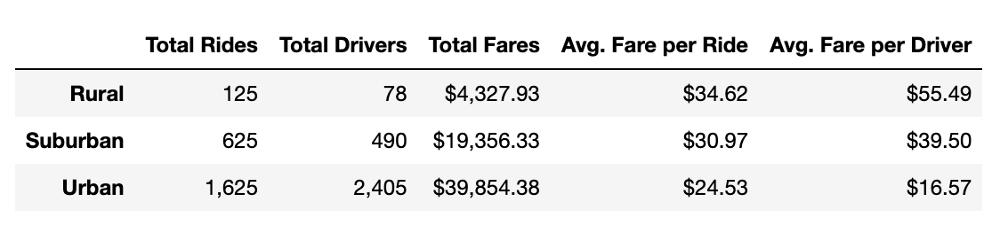
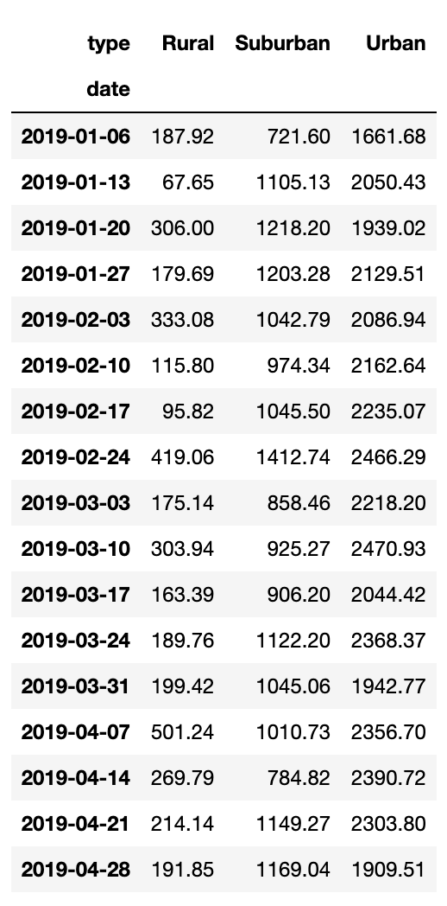
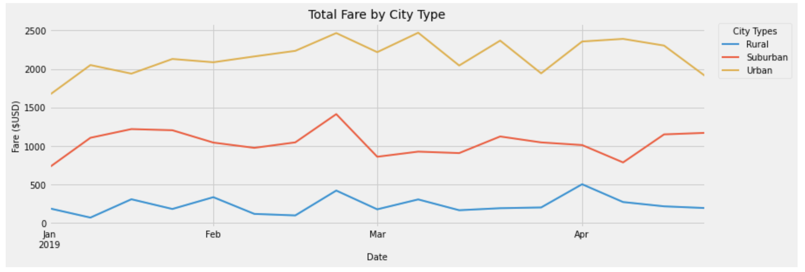

# 05-PyBer_Analysis

## Overview

We analyzed the PyBer ride data to look for trends among the urban, suburban, and rural markets. 

## Results 
### Overall Data Analysis

### Total Fares by City Type

### Fares by City Type Over Time

##Analysis

Unsurprisingly, urban rides and drivers outnumber suburban and rural numbers. It would be useful to check the average distance and duration of the rides to see how much supply and demand impacts these numbers vs. just supply and demand. 

Total fares by week shows that rider trends tend to stay the same across each market. All markets show dips at the beginning of February then a big bump the week of February 24. Rural and Suburban markets tend to stay fairly consistent without large spikes or drops in riders. Urban revenue is a little more volatile, but overall stays within the same ~$500 high/low range of the other markets. 

Rural rides are significantly more expensive than other rides, but overall revenue is very low by comparison due to the low number of rides. It is worth investigating stats on how many users leave the app without booking a ride to see if the low ridership is due to wait times or lack of drivers. If there is not an issue with number of drivers in rural areas, it may be worthwhile to run a promotion in rural areas to increase the customer base in this area.
